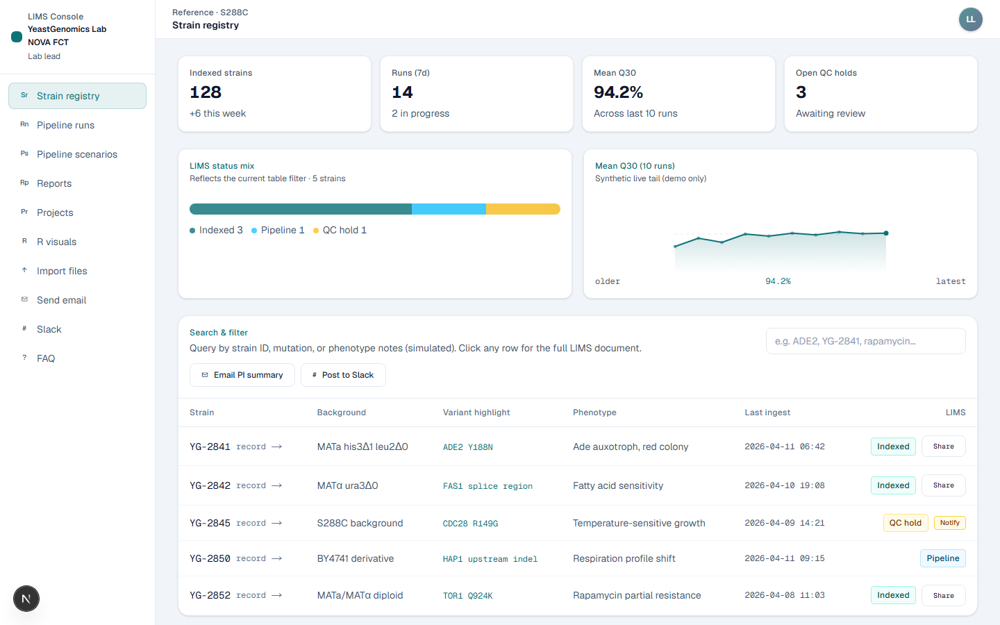
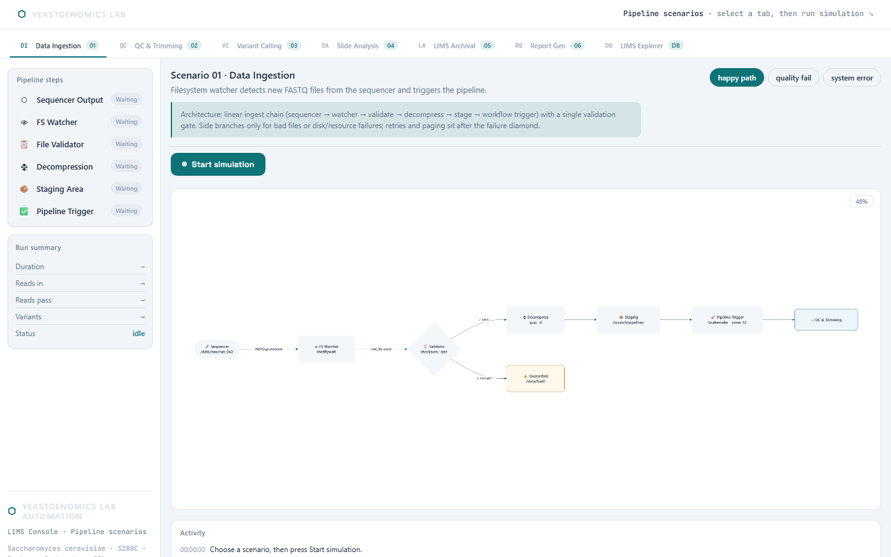
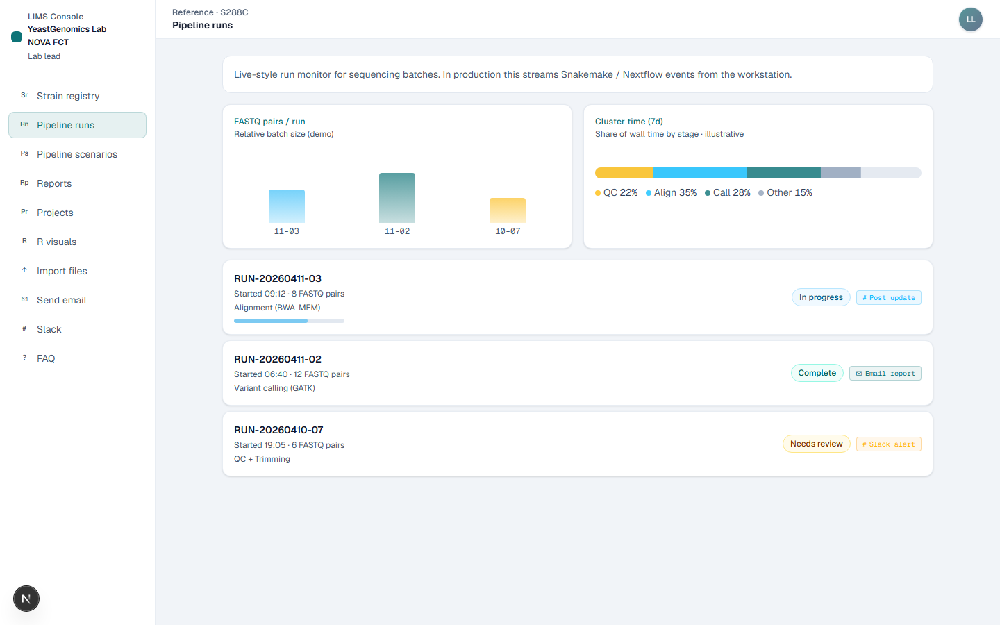
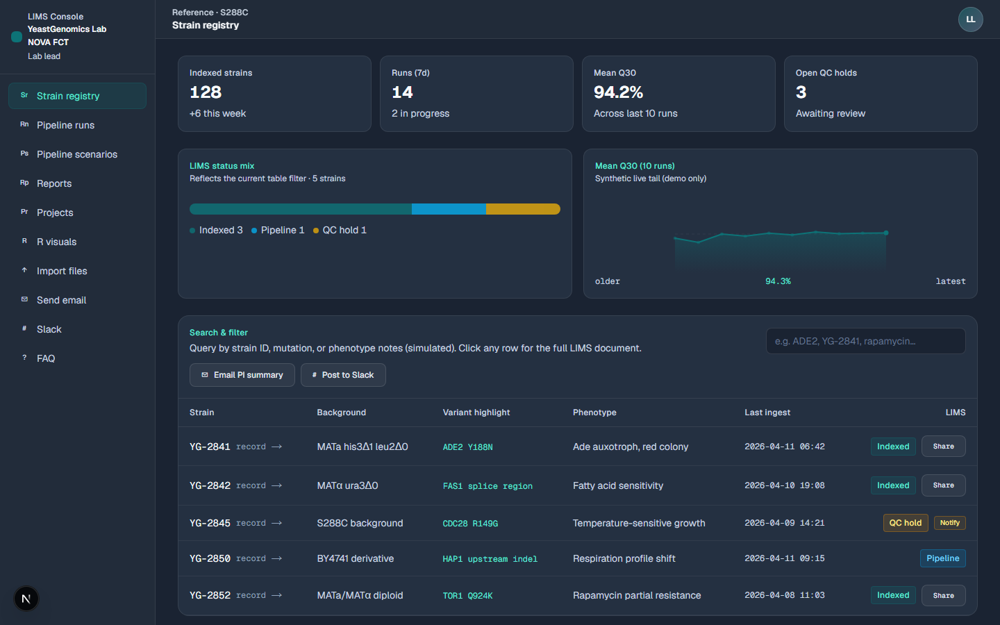
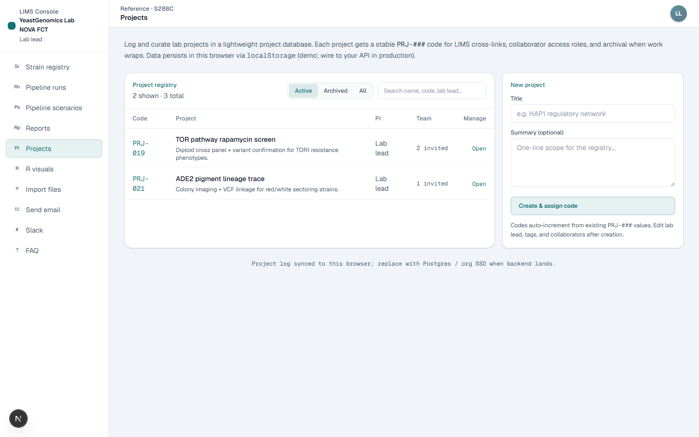
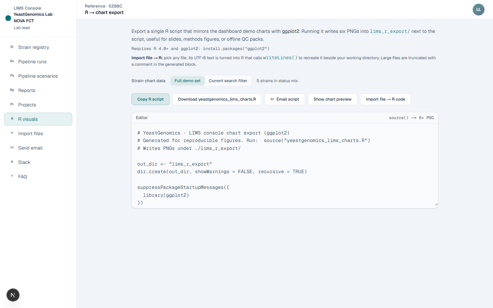
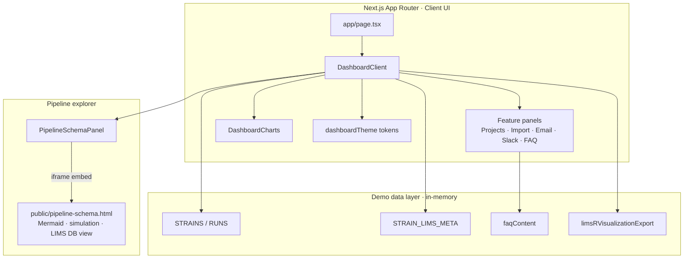

# LIMS Console

**Interactive Laboratory Information Management System demo** for yeast genomics workflows — strain registry, sequencing pipeline monitoring, scenario simulation, reporting, and lab ops integrations.

Built as a stakeholder-ready front-end: calm enterprise UX, light/dark themes, accessibility-minded controls, and fully simulated data (no live sequencers, clusters, or production databases).

[](https://nextjs.org/)
[](https://react.dev/)
[](https://www.typescriptlang.org/)
[](https://tailwindcss.com/)
[](./LICENSE)

> **Demo disclaimer:** Metrics, strains, runs, email, Slack, and file import are simulated for walkthroughs and portfolio review. Not a production GxP system.

---

## Screenshots

<p align="center">
  
  <em>Strain registry — KPIs, status mix, Q30 sparkline, searchable table</em>
</p>

<p align="center">
  
  <em>Pipeline scenarios — Mermaid flowcharts with happy / quality-fail / error paths</em>
</p>

| Light · Pipeline runs | Dark · Strain registry |
| --- | --- |
|  |  |

| Projects workspace | R visualization export |
| --- | --- |
|  |  |

---

## Why this exists

Labs and hiring managers need to *see* how a modern LIMS console feels before investing in integrations. This app is a **pitch / reference console** that demonstrates:

- Traceable strain → run → report flows
- Failure and recovery storytelling (QC holds, system errors, retries)
- Ops surfaces recruiters recognize: dashboards, drawers, exports, notifications
- Front-end craft: theming tokens, ARIA patterns, responsive layout, diagram UX

Domain framing: **YeastGenomics Lab · NOVA FCT** (demo identity; easy to rebrand via `app/labIdentity.ts`).

---

## Features

| Area | What you get |
| --- | --- |
| **Strain registry** | Searchable table, LIMS status badges, detail drawer, quick notify (email / Slack presets) |
| **Pipeline runs** | Active / ok / warn cards, stage progress, volume charts |
| **Pipeline scenarios** | Six Mermaid scenarios (ingest → report) + LIMS explorer; happy / quality-fail / system-error simulations |
| **Reports** | Automated report volume visuals and page-stack summary |
| **Projects** | Project workspace with lifecycle fields and member lists |
| **R visuals** | Client-side R script generation for LIMS chart export (downloadable) |
| **Import files** | Drag-and-drop import with type detection and text preview |
| **Send email / Slack** | Simulated lab communications with realistic forms |
| **FAQ** | In-app enterprise + developer FAQ (`app/dashboard/faqContent.ts`) |
| **Theming** | Light / dark lab palette, high-contrast toggle, shared design tokens |

---

## Architecture



**Stack choices**

- **Next.js 16 + React 19** — App Router, client-heavy dashboard with clear module boundaries
- **TypeScript** — typed domain rows, panel props, theme helpers
- **Tailwind CSS 4** — utility styling with a shared token module (`dashboardTheme.ts`) instead of scattered one-offs
- **Mermaid.js (CDN)** — pipeline topology + failure-path storytelling in a self-contained HTML explorer
- **No backend** — intentional: zero secrets, instant clone → run for recruiters

---

## Project structure

```text
app/
  page.tsx                 # Home → dashboard shell
  layout.tsx               # Fonts + metadata
  labIdentity.ts           # Lab branding / demo contacts
  dashboard/
    DashboardClient.tsx    # Shell, nav, strain/runs/reports/R views
    DashboardCharts.tsx    # KPI visuals, sparklines, stacked bars
    dashboardTheme.ts      # Light/dark design tokens
    PipelineSchemaPanel.tsx
    ProjectsWorkspace.tsx
    ImportFilesPanel.tsx
    SendEmailPanel.tsx
    SlackPanel.tsx
    FaqPanel.tsx + faqContent.ts
    limsRVisualizationExport.ts
public/
  pipeline-schema.html     # Shell · Mermaid scenario simulator
  pipeline-schema.css      # Theme / layout styles
  pipeline-schema-scenarios.js
  pipeline-schema-lims-db.js
docs/screenshots/          # README assets
scripts/
  capture-screenshots.mjs  # Playwright capture helper
```

---

## Quick start

Requires **Node.js 20+**.

```bash
npm install
npm run dev
```

Open **[http://localhost:3001](http://localhost:3001)** (port **3001** so it can sit beside a pitch site on 3000).

| Script | Purpose |
| --- | --- |
| `npm run dev` | Dev server on `:3001` |
| `npm run build` | Production build |
| `npm run start` | Serve production build |
| `npm run lint` | ESLint |

Optional — regenerate README screenshots (dev server must be running):

```bash
node scripts/capture-screenshots.mjs
```

---

## Deploy

Deploy as a standalone **Vercel** (or any Node) project from this repo.

If you also run a separate marketing/pitch site, point that site’s `LIMS_CONSOLE_URL` at this deployment’s origin.

---

## Design notes

- **Tokenized theming** — surfaces, nav, tables, drawers share `dashboardTokens()` / `drawerTokens()` rather than hard-coded one-offs per panel
- **Demo safety** — no API keys, no `.env` required, no real PII; integrations are UI-complete simulations
- **Ops storytelling** — pipeline scenarios encode happy / QC / error graphs so demos aren’t only “happy path”
- **A11y basics** — settings menu stays in DOM with `hidden`, avatar uses `aria-expanded` / `aria-haspopup` / `aria-controls`
- **Diagram UX** — Mermaid prerender + zoom/pan, theme-aware embed via `?theme=light|dark`

---

## License

MIT — see [LICENSE](./LICENSE).

---

## FAQ

Product and engineering FAQ lives **in the app** (sidebar → **FAQ**). Source: [`app/dashboard/faqContent.ts`](./app/dashboard/faqContent.ts). Short pointer: [FAQ.md](./FAQ.md).
